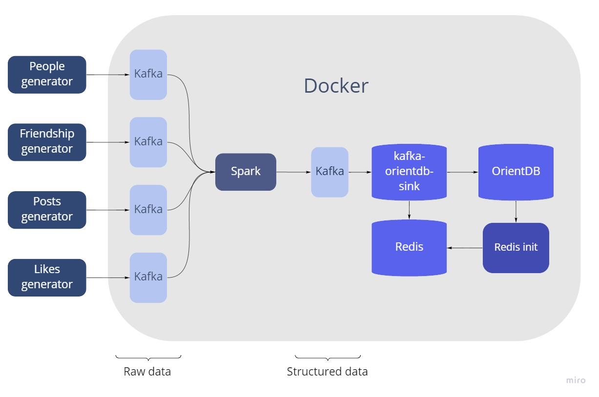

# Graphs Warehouse & Processing System
## Архитектура. 

### Используемые фреймворки. 

|       Сервисы       |                                             Описание                                             |
|:-------------------:|:------------------------------------------------------------------------------------------------:|
|       Docker        |                      Автоматизация развёртывания и управления приложениями                       | 
|    Kafka     |                                         Строка содержит                                          |
|        Redis        |                    Используется  для OrientDB, чтобы не записывать дубликаты                     |
|     Redis init      |                                         Строка содержит                                          |
|    Spark     |                                         Строка содержит                                          |
| Kafka-orientdb-sink |                                         Строка содержит                                          |
|      OrientDB       | графовая СУБД, в вершинах -- пользователей и посты; ребрах --  связи между мользователями и лайк |

### Важные пути:
Генератор на Python -- data-generator/generator.py \
Конфиг OrientDB1 -- orientdb/odb1/config\
Конфиг OrientDB2 -- orientdb/odb2/config\
Инициализация БД -- orientdb-init/setup.txt\
Докер образы -- docker-compose.yml

### Плюсы архитектуры:

  - Запись в две OrientDB через Kafka-orientdb-sink 
  - Возможность расширить функционал как генератора, так и БД

### Минусы архитектуры: 
- Есть вероятность потерять данные, если БД упадет а запись будет в Redis. \
Решение -- сначала записывать в БД а потом проверять на дубликаты в Redis

### Запуск:
   - Шаг 1 -- инициализировать БД (подождать 90 секунд):\
``docker-compose up -d odb1 odb2 odb-init``
   - Шаг 2 -- запустить остальные образы:\
``docker-compose up -d``
   - Шаг 3 -- Есть вариант запустить кастомный генератор:\
``python data-generator/generator.py``
   - Шаг 4 -- Или использовать генератор от Фрола, тут стоит дополнить

UI OrientDB: [OrientDB1](http://localhost:2481)  [OrientDB2](http://localhost:2482)